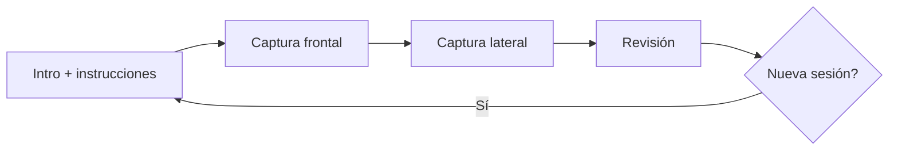

# Fase 1 — Captura guiada (escaneo corporal)

## Objetivo

Ofrecer un flujo visual premium para obtener **dos fotos de cuerpo completo** (frontal y lateral) mediante **cámara en vivo** o **subida de imagen**, con instrucciones claras y almacenamiento **temporal solo en el navegador**.

En esta fase **no** se genera avatar 3D ni se envían imágenes al backend.

## Alcance entregado

### Funcionalidades

1. **Foto frontal** — cuerpo completo, brazos ligeramente separados.
2. **Foto lateral** — perfil izquierdo, mismo encuadre vertical.
3. **Instrucciones visuales** (5 ítems):
   - Cuerpo completo visible
   - Brazos ligeramente separados
   - Buena iluminación
   - Fondo limpio
   - Cámara recta
4. **Modos de captura**: cámara (`getUserMedia`) o archivo (JPG/PNG/WebP).
5. **Silueta guía** superpuesta en el visor (SVG frontal / lateral).
6. **Wizard** de 4 pasos: Intro → Frontal → Lateral → Revisión.
7. **Persistencia temporal** en `sessionStorage` (clave `jotape-body-scan-session-v1`).

### Rutas

- `/account/measurements/scan` — área de cuenta (requiere login)
- `/try-on/body-scan` — Try-On Lab (público)

### Componentes principales

| Archivo | Rol |
|---------|-----|
| `components/body-scan/body-scan-flow.tsx` | Orquestador del wizard |
| `components/body-scan/body-scan-capture-panel.tsx` | Cámara / upload / obturador |
| `components/body-scan/body-scan-instructions.tsx` | Lista de consejos |
| `components/body-scan/body-scan-step-progress.tsx` | Indicador de pasos |
| `components/body-scan/body-scan-silhouette.tsx` | Guía SVG en visor |
| `hooks/use-body-scan-session.ts` | Estado + persistencia |
| `lib/body-scan/capture-frame.ts` | Frame → JPEG (máx. 1920 px) |
| `lib/body-scan/scan-session-storage.ts` | CRUD en sessionStorage |
| `lib/body-scan/scan-instructions.ts` | Textos de guía |
| `types/body-scan.ts` | Tipos de sesión y capturas |

## Modelo de datos (fase 1)

```typescript
type BodyScanImageCapture = {
  view: "front" | "side";
  dataUrl: string;       // image/jpeg en base64
  width: number;
  height: number;
  mimeType: string;
  source: "camera" | "upload";
  capturedAt: string;    // ISO 8601
  pose?: BodyScanPoseAnalysis;  // rellenado en fase 2
};

type BodyScanSession = {
  id: string;
  status: "draft" | "capturing" | "complete";
  front?: BodyScanImageCapture;
  side?: BodyScanImageCapture;
  createdAt: string;
  updatedAt: string;
};
```

## Flujo de usuario



1. El usuario lee las instrucciones y pulsa **Comenzar captura**.
2. En **frontal**: alinea el cuerpo, dispara obturador o sube foto, confirma **Usar esta foto**.
3. En **lateral**: mismo proceso.
4. En **revisión**: ve miniaturas; puede repetir cada vista o iniciar sesión nueva.

## Diseño UI

- Reutiliza tokens del probador: `GlassPanel`, `TryOnSectionLabel`, `CameraHudFrame`, gradientes violeta/sky.
- Visor con relación **3:4** y esquinas HUD.
- Espejo horizontal solo en cámara frontal `facingMode: "user"`.
- Botón **Voltear** para alternar cámara frontal/trasera en móvil.

## Privacidad

- Las imágenes **no** se suben al servidor en fase 1.
- Se guardan en `sessionStorage` del navegador hasta cerrar la pestaña o borrar la sesión.
- **No incluir** `.env` ni capturas reales en commits.

## Cómo probar

```bash
cd jotape-vf/frontend
npm run dev
```

1. Abrir `http://127.0.0.1:3000/try-on/body-scan` (sin login) o `/account/measurements/scan` (con sesión).
2. Conceder permiso de cámara (HTTPS o localhost).
3. Completar frontal y lateral; verificar revisión y recarga de página (sesión restaurada).

## Limitaciones conocidas (fase 1)

- Tamaño de `sessionStorage` (~5 MB): fotos muy grandes pueden fallar al guardar (se mantiene en memoria).
- Sin validación automática de pose (eso es **fase 2**).
- Altura de referencia fija para medidas posteriores (170 cm hasta fase 3).

## Relación con fase 2

Al confirmar cada foto, el flujo invoca `analyzeBodyScanCapture()` (ver [fase-2-mediapipe-pose.md](./fase-2-mediapipe-pose.md)). Si la pose no es válida, el usuario permanece en el paso actual con mensaje de error.
