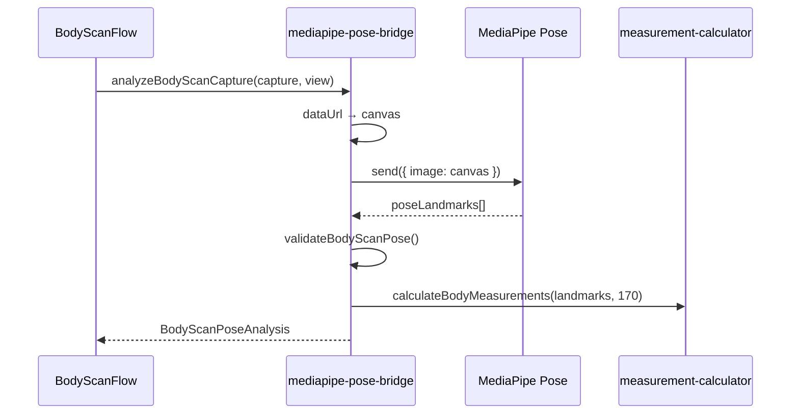

# Fase 2 — MediaPipe Pose (análisis estático)

## Objetivo

Tras cada captura de la fase 1, ejecutar **MediaPipe Pose** sobre la imagen estática para:

1. Detectar **landmarks** corporales (33 puntos, subconjunto clave usado en medidas).
2. **Validar** que el encuadre sirve para medir (cuerpo completo, visibilidad).
3. **Estimar medidas** en centímetros (hombros, cadera, cintura, altura).
4. Mostrar **overlay** de esqueleto en la revisión.

Sigue **sin** generar avatar 3D ni persistir en backend.

## Dependencias

```json
"@mediapipe/pose": "^0.5.1675469404",
"@mediapipe/camera_utils": "^0.3.1675466862"
```

El modelo se descarga en runtime desde jsDelivr:

`https://cdn.jsdelivr.net/npm/@mediapipe/pose/{archivo}`

## Punto de integración

**Archivo:** `frontend/src/lib/body-scan/mediapipe-pose-bridge.ts`

| Función | Descripción |
|---------|-------------|
| `isBodyScanPosePipelineEnabled()` | `true` en cliente (browser) |
| `analyzeBodyScanCapture(capture, view, referenceHeightCm?)` | Análisis de una foto |
| `disposeBodyScanPoseModel()` | Libera instancia al desmontar el flujo |

### Flujo interno



### Resultado (`BodyScanPoseAnalysis`)

```typescript
type BodyScanPoseStatus =
  | "idle" | "pending" | "ready" | "error" | "skipped";

type BodyScanPoseAnalysis = {
  status: BodyScanPoseStatus;
  landmarks?: PoseLandmark[];      // normalizados 0–1
  quality?: number;                 // 0–1 visibilidad media
  measurements?: BodyMeasurements;
  errorMessage?: string;
  analyzedAt?: string;
};
```

| Status | Significado |
|--------|-------------|
| `ready` | Pose válida + medidas calculadas |
| `error` | Sin persona, pose inválida o timeout |
| `skipped` | Solo SSR / pipeline desactivado |

## Validación de pose

**Archivo:** `frontend/src/lib/body-scan/body-scan-pose-validation.ts`

Comprueba:

- Landmarks clave visibles (nariz, hombros, caderas, tobillos) — umbral visibilidad ≥ 0.35
- Altura del cuerpo en frame (~45%–95% del eje Y)
- Frontal: separación mínima entre hombros
- Lateral: hombros no demasiado separados en X (perfil)

Si falla, `analyzeBodyScanCapture` devuelve `status: "error"` con `errorMessage` y el wizard **no avanza** desde el paso frontal (si falla frontal).

## Medidas estimadas

Reutiliza `lib/virtual-fitting/measurement-calculator.ts` (misma lógica que el probador 2D en `/try-on`):

| Campo | Descripción |
|-------|-------------|
| `shoulderWidthCm` | Distancia hombro–hombro escalada |
| `hipWidthCm` | Distancia cadera–cadera |
| `waistEstimateCm` | Estimación a partir de torso |
| `heightEstimateCm` | Nariz → tobillos |
| `poseQuality` | Media de visibilidad de puntos clave |

**Altura de referencia por defecto:** 170 cm (hasta que el perfil de usuario aporte altura real en fase 3).

En revisión, si ambas vistas son `ready`, se muestra la captura con **mayor `poseQuality`** en `BodyScanMeasurementsSummary`.

## UI añadida en fase 2

| Componente | Función |
|------------|---------|
| `body-scan-analyzing-overlay.tsx` | Modal “Analizando pose…” durante inferencia |
| `body-scan-pose-thumb.tsx` | Miniatura + canvas con landmarks |
| `body-scan-measurements-summary.tsx` | Panel de medidas (reusa `BodyMeasurementsPanel`) |
| `body-scan-review.tsx` | Actualizado con estado MediaPipe |

### Overlay de landmarks

- Conexiones dibujadas: hombros, torso, piernas, cabeza.
- Puntos clave en verde esmeralda (`KEY_LANDMARK_INDICES`).
- Badge: **Pose OK · N%** o **Revisar pose**.

## Rendimiento

- **Primera inferencia:** descarga del modelo (~varios MB); overlay avisa al usuario.
- **Instancia singleton** de `Pose` reutilizada entre capturas de la misma sesión.
- **Timeout:** 20 s por imagen.
- Al salir del flujo, `disposeBodyScanPoseModel()` cierra el modelo.

## Pruebas

```bash
cd jotape-vf/frontend
npm run test -- --testPathPattern=body-scan
```

- `scan-session-storage.test.ts` — persistencia
- `body-scan-pose-validation.test.ts` — reglas de encuadre

## Cómo probar manualmente

1. `npm run dev` en `frontend/`
2. Ir a `/try-on/body-scan`
3. Capturar frontal con cuerpo completo bien iluminado
4. Esperar overlay de análisis (primera vez más lento)
5. Si **Pose OK**, continuar a lateral
6. En revisión: ver esqueleto superpuesto y panel de medidas

### Errores frecuentes

| Síntoma | Causa probable | Acción |
|---------|----------------|--------|
| “No se detectó una pose” | Persona recortada / fondo confuso | Repetir con fondo liso |
| “Aleja la cámara” | Cuerpo muy pequeño en frame | Acercar o zoom |
| “Separa los brazos” | Brazos pegados al torso (frontal) | Separar brazos |
| Timeout | Red lenta al cargar CDN | Reintentar; comprobar conexión |

## Seguridad y privacidad

- Inferencia **100 % en cliente**; landmarks y medidas no se envían al API en esta fase.
- Imágenes siguen solo en `sessionStorage`.
- CDN externo para pesos del modelo: valorar self-host en producción estricta.

## Archivos tocados (fase 2)

```
frontend/src/lib/body-scan/mediapipe-pose-bridge.ts      (implementación)
frontend/src/lib/body-scan/body-scan-pose-validation.ts
frontend/src/components/body-scan/body-scan-pose-thumb.tsx
frontend/src/components/body-scan/body-scan-measurements-summary.tsx
frontend/src/components/body-scan/body-scan-analyzing-overlay.tsx
frontend/src/types/body-scan.ts                          (+ measurements en pose)
```

## Siguiente paso — Fase 3

Ver [fase-3-roadmap.md](./fase-3-roadmap.md): aplicar medidas al avatar GLB, altura del perfil, API de persistencia, recomendación de talla enlazada.
